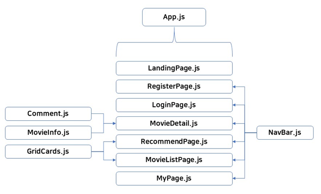

# 영화추천플랫폼 "영화보러갈래" (v2)_frontend

단국대학교 2021학년도 실무중심산학협력프로젝트 영화 추천 플랫폼 "영화보러갈래"

### frontend

서비스 웹 프론트엔드 구현

개발 언어 및 프레임워크
- nodejs
- react
- react_redux

컴포넌트 구성




## 프로젝트 설치

본 프로젝트 repository를 프로젝트를 설치하고자 하는 시스템에 내려받습니다.

```
git clone https://github.com/live2skull/DKU2020_Movie_Recommender
```

### frontend 설치 및 준비

1. nodejs 설치

    `nodejs 12` 이상의 nodejs를 시스템에 설치합니다.

2. 의존 패키지 설치

    프론트엔드 구성에 필요한 의존 패키지를 설치합니다. 설치에 수 분이 소요됩니다.

    ```
    npm install
    ```

3. 프론트엔드 실행 테스트

    프론트엔드 테스트용 배포 서버를 실행합니다.

    ```
    npm run start
    ```

    성공적으로 서버가 실행되었다면 다음 메세지가 출력됩니다.

    ```
    Compiled successfully!

    You can now view team-movie in the browser.

    http://localhost:3001

    Note that the development build is not optimized.
    To create a production build, use yarn build.
    ```
    
    해당 배포 서버로 접속해 정상적으로 동작하는지 확인합니다.

4. static 파일 컴파일

    서비스를 위한 static 파일을 컴파일합니다. 수 분이 소요됩니다.
    ```
    npm run build
    ```
    
    frontend 디렉터리의 `build` 폴더 내부에 컴파일된 파일들이 출력되며, 운영 상황에 맞게 static 파일을 웹 서버에 배포해 서비스합니다.
